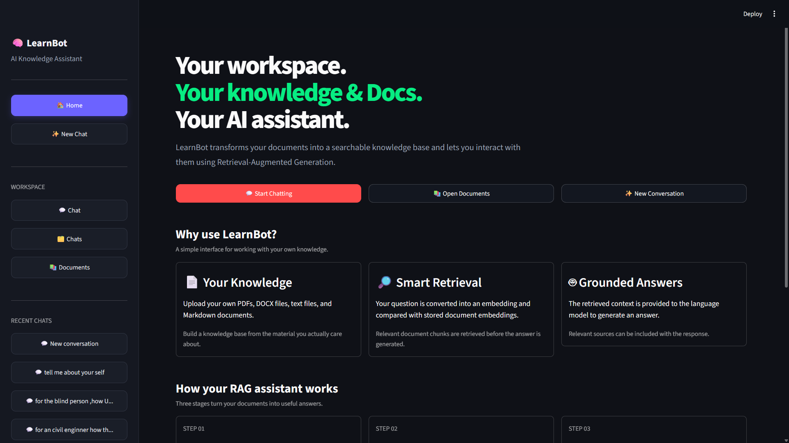
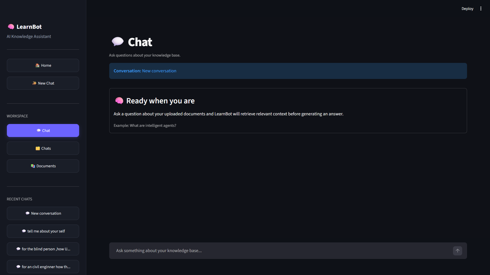
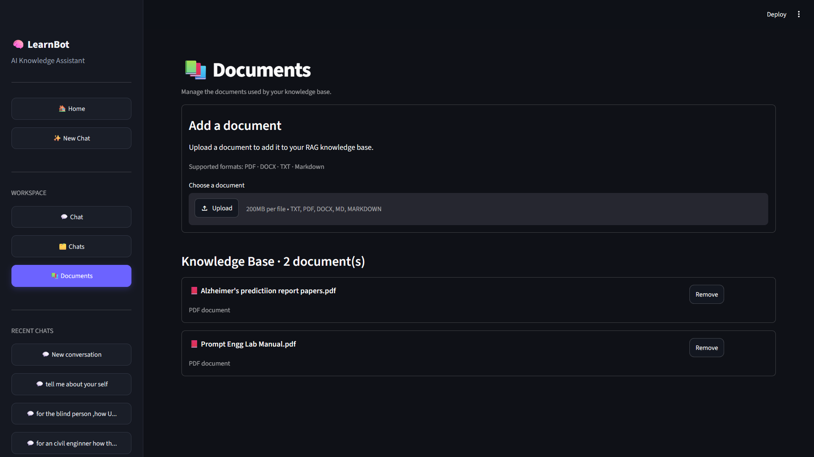
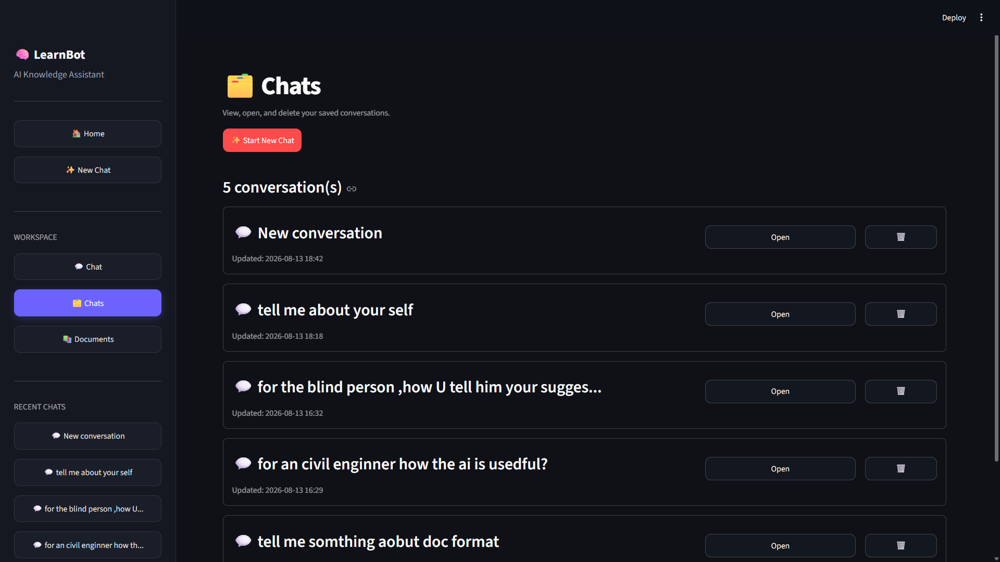

# 🤖 LearnBot — AI Knowledge Assistant

> A modular AI-powered knowledge assistant that turns your own documents into a searchable knowledge base and uses Retrieval-Augmented Generation (RAG) to answer questions with relevant context.

## 📖 Overview

**LearnBot** is an AI Knowledge Assistant built with Python. The project has evolved from a basic LLM chatbot into a **basic end-to-end RAG application** with a user-facing Streamlit interface.

The application allows users to:

- Upload their own knowledge documents.
- Process and index those documents.
- Convert document chunks into embeddings.
- Store embeddings in ChromaDB.
- Ask questions about the uploaded knowledge.
- Retrieve relevant document context.
- Generate answers using an LLM.
- Keep and manage multiple conversations.
- View and manage documents in the knowledge base.

The project is being developed incrementally with a focus on understanding the architecture and engineering principles behind modern AI/RAG systems.

---

## ✨ Key Features

### 📚 Knowledge Base

Supported document formats currently include:

- PDF
- DOCX
- TXT
- Markdown

Uploaded documents are processed and added to the RAG knowledge base.

### 🧠 Embeddings

Document chunks and user queries are converted into vector embeddings using a local **Sentence Transformer** model.

### 🗄️ ChromaDB Vector Store

**ChromaDB** is used to store document embeddings and metadata and to perform similarity-based retrieval.

### 🔎 Semantic Retrieval

When a user asks a question:

1. The question is converted into an embedding.
2. ChromaDB searches for similar document chunks.
3. Relevant chunks are selected.
4. The retrieved context is provided to the LLM.
5. The LLM generates the final response.

### 🎯 Relevance-Aware RAG

The application includes a relevance check so that weak or unrelated retrieval results are not blindly treated as authoritative context.

When relevant knowledge is found, the answer can be grounded in the retrieved documents. When the knowledge base does not provide sufficiently relevant information, the application can fall back to general LLM knowledge.

### 📑 Source-Aware Answers

Retrieved document information can be associated with the generated response so users can understand which knowledge-base sources contributed to an answer.

### 💬 Conversation Management

The application provides a chat workspace where users can:

- Start a new conversation.
- Continue existing conversations.
- View saved conversations.
- Open previous chats.
- Delete conversations.
- Use the first question as a meaningful conversation title.

### 🖥️ Streamlit Interface

The application includes a Streamlit UI with dedicated areas for:

- Home
- Chat
- Chats
- Documents

The interface is designed to keep the main RAG workflow simple and easy to use.

---

## 🖼️ Application Screenshots

### 🏠 Home

The home page introduces LearnBot and provides quick access to chatting, documents, and new conversations.



### 💬 Chat

The chat workspace allows users to ask questions about their uploaded knowledge base and receive RAG-based answers.



### 📄 Documents

The Documents section allows users to upload supported files and manage the documents currently used by the knowledge base.




### 🗂️ Chats

The Chats section provides access to saved conversations, allowing users to open or delete previous chats.



---

## 🔄 How the RAG Pipeline Works

The current basic RAG flow can be summarized as:

```text
                DOCUMENT INGESTION
                       │
                       ▼
                 Document Loader
                       │
                       ▼
                  Document Model
                       │
                       ▼
                 Text Chunking
                       │
                       ▼
             Sentence Transformer
                       │
                       ▼
                  Embeddings
                       │
                       ▼
                    ChromaDB
                       │
                       │
                 Knowledge Base
                       │
                       ▼
                  User Query
                       │
                       ▼
                Query Embedding
                       │
                       ▼
              Similarity Retrieval
                       │
                       ▼
              Relevance Evaluation
                       │
              ┌────────┴────────┐
              │                 │
           Relevant        Not Relevant
              │                 │
              ▼                 ▼
       Retrieved Context    General LLM
              │              Knowledge
              └────────┬────────┘
                       ▼
                      LLM
                       │
                       ▼
                Final Response
```

This is the core **end-to-end RAG capability** currently implemented in the project.

---

## 🏗️ High-Level Architecture

The project is organized into separate components so that document processing, retrieval, LLM interaction, conversations, and the UI do not have to live in one monolithic module.

```text
AI Knowledge Assistant
│
├── Application / UI
│   └── Streamlit
│
├── Chat
│   ├── Chatbot
│   ├── Commands
│   └── Conversation Management
│
├── Documents
│   ├── Loaders
│   ├── Document Model
│   └── Chunking
│
├── Embeddings
│   └── Sentence Transformer
│
├── Vector Store
│   └── ChromaDB
│
├── Retrieval
│   ├── Similarity Search
│   ├── Relevance Check
│   └── Context Construction
│
├── LLM
│   └── Groq
│
└── Tests
```

---

## 🛠️ Tech Stack

| Area | Technology |
|---|---|
| Programming Language | Python |
| LLM | Groq |
| Embeddings | Sentence Transformers |
| Vector Database | ChromaDB |
| User Interface | Streamlit |
| Configuration | python-dotenv |
| Conversation Storage | JSON |
| Version Control | Git / GitHub |

---

## 📁 Project Structure

The project is organized into modular components. The exact structure may continue to evolve as development progresses.

```text
AI-Knowledge-Assistant/
│
├── app/
├── chat/
├── loaders/
├── models/
├── chunkers/
├── embeddings/
├── vectordb/
├── retrieval/
├── rag/
├── llms/
├── ui/
├── tests/
├── data/
│   └── uploads/
│
├── requirements.txt
├── .env
├── .gitignore
└── README.md
```

---

## ⚙️ Getting Started

### 1. Clone the repository

```bash
git clone https://github.com/<your-github-username>/AI-Knowledge-Assistant.git
cd AI-Knowledge-Assistant
```

### 2. Create a virtual environment

```bash
python -m venv .venv
```

Activate it on Windows:

```bash
.venv\Scripts\activate
```

On Linux/macOS:

```bash
source .venv/bin/activate
```

### 3. Install dependencies

```bash
pip install -r requirements.txt
```

### 4. Configure environment variables

Create a `.env` file in the project root and add your Groq API key:

```env
GROQ_API_KEY=your_groq_api_key
```

Do not commit `.env` or API keys to GitHub.

### 5. Run the application

Use the project's current Streamlit entry point, for example:

```bash
streamlit run <your_streamlit_entry_file>.py
```

If your repository uses a module-based entry point, use the command defined by the current project structure.

---

## 🧪 Testing

The project follows an incremental development approach:

```text
Implement
   ↓
Test
   ↓
Verify
   ↓
Fix
   ↓
Continue
```

Testing has covered core components such as:

- Document loading
- Document representation
- Text chunking
- Embedding generation
- ChromaDB operations
- Similarity search
- Retrieval behavior
- RAG behavior
- UI functionality

The goal is to verify each major layer before moving deeper into the roadmap.

---

## 📊 Current Project Status

### ✅ Completed

- Basic LLM chatbot
- Groq integration
- Environment-based configuration
- Modular document loading
- PDF/DOCX/TXT/Markdown ingestion
- Document model
- Text chunking
- Sentence Transformer embeddings
- ChromaDB vector storage
- Similarity retrieval
- Relevance-aware retrieval
- Context construction
- LLM-based answer generation
- Basic source-aware responses
- Fallback behavior
- Streamlit UI
- Document management UI
- Chat management UI
- Basic end-to-end RAG application

### 🔄 Current Focus

The project is now focused on **stabilizing and improving the basic RAG application**, especially:

- Retrieval quality
- Relevance-threshold tuning
- End-to-end verification
- Conversation persistence
- Error handling
- RAG evaluation
- UI reliability

### ⏳ Planned

- Advanced retrieval strategies
- Hybrid search
- Reranking
- Better RAG evaluation
- Conversational RAG
- LangChain where appropriate
- LangGraph workflows
- Tool calling
- AI agents
- Production-oriented architecture
- FastAPI backend
- Authentication and authorization
- Deployment
- Monitoring and observability

---

## 🗺️ Development Roadmap

```text
✅ Basic AI Chatbot
        ↓
✅ Document Processing
        ↓
✅ Embeddings
        ↓
✅ ChromaDB
        ↓
✅ Semantic Retrieval
        ↓
✅ Basic End-to-End RAG
        ↓
🔄 RAG Stabilization & Evaluation
        ↓
⏳ Improved Retrieval
        ↓
⏳ Production-Oriented RAG
        ↓
⏳ LangChain / LangGraph
        ↓
⏳ AI Agents
        ↓
⏳ Advanced Agentic AI
        ↓
⏳ Production Deployment
```

The project intentionally builds the fundamentals first before moving into more complex agentic architectures.

---

## 📚 Learning Outcomes

This project has provided practical experience with:

- Python project architecture
- LLM API integration
- Prompt management
- Document ingestion
- File loaders
- Text chunking
- Embeddings
- Vector databases
- ChromaDB
- Similarity search
- Retrieval-Augmented Generation
- Relevance evaluation
- Context construction
- Source-aware generation
- Conversation management
- Streamlit application development
- Testing and debugging
- Git and GitHub

---

## 🔮 Future Development

The long-term goal is to evolve LearnBot from a basic RAG application into a more capable and production-oriented AI knowledge system.

Potential future capabilities include:

- Better retrieval and reranking
- Multi-document reasoning
- Conversational RAG
- Query transformation
- Tool calling
- Web search
- Document comparison
- Summarization
- LangGraph-based workflows
- AI agents
- Multi-agent systems where justified
- FastAPI services
- Cloud deployment
- Monitoring and tracing
- Evaluation pipelines
- Production-grade reliability and security

---

## 📜 License

This project is licensed under the **MIT License**.

---

## 👨‍💻 About the Author

### Prince Prem

Aspiring **AI Engineer** focused on learning and building practical AI systems through hands-on projects.

---
